# Design Thinking

## 1. EMPATHIZE

### Siapa penggunanya?
- **Pasien umum** — Berbagai usia, latar belakang, dan tingkat literasi.
- **Lansia** — Tidak familiar dengan teknologi, mungkin memiliki gangguan visual atau pendengaran.
- **Pendamping pasien** — Keluarga yang panik dan terburu-buru.
- **Staf pendaftaran** — Overload, harus menangani banyak pasien sekaligus.
- **Dokter / perawat poli** — Membutuhkan informasi pasien sebelum pasien datang.

### Pain points yang ditemukan:
- Pasien tidak tahu harus ke poli mana.
- Antrian pendaftaran panjang karena semua proses masih manual.
- Pasien salah poli → kembali ke pendaftaran → antrian ulang.
- Lansia kesulitan membaca papan petunjuk.
- Staf kelelahan karena triage dilakukan secara manual satu per satu.
- Pasien tidak tahu kapan gilirannya dipanggil → duduk terus di ruang tunggu.
- Setelah dari dokter, pasien tidak tahu harus ke apotek atau laboratorium mana.

---

## 2. DEFINE — Rumuskan Masalah

### Problem Statement
> Pasien yang datang ke rumah sakit tidak memiliki informasi yang cukup untuk menavigasi proses pelayanan secara mandiri — mulai dari menentukan poli yang tepat hingga menyelesaikan seluruh rangkaian kunjungan — sehingga bergantung penuh pada staf dan menciptakan bottleneck di pendaftaran.

### How Might We (HMW):
- **HMW** membuat pasien tahu poli yang tepat tanpa harus bertanya kepada staf?
- **HMW** membantu pasien yang tidak bisa membaca atau tidak melek teknologi?
- **HMW** mengurangi beban staf pendaftaran tanpa mengorbankan kualitas layanan?
- **HMW** memastikan pasien tahu langkah berikutnya setelah tiap tahap selesai?

---

## 3. IDEATE — Eksplorasi Solusi

### Ide untuk Input Gejala:
- Form digital dengan ikon bergambar (tanpa teks).
- Voice input — pasien cukup berbicara.
- WhatsApp bot sebelum berangkat ke RS.
- Staf input dengan auto-suggest sistem.

### Ide untuk Diagnosa & Rekomendasi Poli:
- LLM mengekstrak gejala dari input bebas → rule engine menentukan poli.
- Kombinasi symptom checker berbasis keputusan + AI.
- Override manual oleh staf jika sistem tidak yakin.

### Ide untuk Navigasi:
- Tiket fisik dengan peta mini + warna poli.
- Garis warna di lantai.
- Voice announcement di speaker koridor.
- Indoor navigation via QR di tiket.

### Ide untuk Post-Poli:
- Notifikasi WA saat giliran hampir tiba.
- Tiket lanjutan otomatis ke apotek/lab.
- Ringkasan kunjungan dikirim via WA setelah selesai.

---

## 4. PROTOTYPE — Bentuk Solusi

### MVP (Minimum Viable Product):

```text
       [ Kiosk / Tablet Staf ]
                  ↓
Input gejala (voice / touch / assisted)
                  ↓
       Symptom Extractor (LLM)
                  ↓
   Triage Engine (rule-based + LLM)
                  ↓
               Output:
        - Rekomendasi poli
        - Nomor antrian
        - Cetak tiket (nama poli + lantai + warna jalur)
                  ↓
   Notifikasi WA saat giliran dekat
                  ↓
 Setelah dokter → tiket lanjutan ke apotek/lab
```

### Komponen yang dibangun:
- **Backend**: FastAPI + LLM integration.
- **Triage rules**: Dikurasi bersama dokter RS.
- **Kiosk UI**: Touchscreen besar, font besar, ada tombol voice.
- **Tiket**: Cetak thermal printer, ada peta mini + warna.
- **Notifikasi**: WhatsApp Business API / n8n.

---

## 5. TEST — Validasi

### Skenario uji:
- **Lansia 65 tahun tanpa smartphone** → Apakah bisa menggunakan kiosk secara mandiri?
- **Pasien dengan keluhan ambigu** → Apakah triage engine mengarahkan ke poli yang tepat?
- **Pasien salah poli** → Seberapa cepat sistem bisa mengoreksi?
- **Peak hour (pagi hari)** → Apakah sistem tetap responsif dengan 50+ pasien bersamaan?

### Metrik keberhasilan:
- Waktu pendaftaran per pasien turun dari X menit → target < 2 menit.
- Tingkat salah poli < 5%.
- Kepuasan pasien (survey singkat di akhir kunjungan).
- Beban staf pendaftaran berkurang minimal 40%.

### Iterasi:
- Triage rules divalidasi dokter tiap bulan.
- UI kiosk diuji dengan pasien lansia nyata sebelum launch.
- Feedback staf dikumpulkan 2 minggu pertama operasional.

---

## Ringkasan

| Tahap | Output Kunci |
| :--- | :--- |
| **Empathize** | 5 user persona, 7 pain points |
| **Define** | 1 problem statement, 4 HMW questions |
| **Ideate** | 12+ solusi potensial lintas touchpoint |
| **Prototype** | MVP flow + tech stack |
| **Test** | 4 skenario uji + 3 metrik sukses |

---

## Alur Alur Pelayanan (Flowchart)

```mermaid
flowchart TD
    %% QUICK EMERGENCY SCREEN (BARU - paling depan)
    A1[Datang ke kiosk]
    A0[Quick screen: tombol besar/voice\nApakah ini darurat? + red-flag listening]
    A0d{Darurat jelas?}

    %% IDENTIFIKASI
    B1[Identifikasi pasien\nFingerprint / Face / NIK manual]
    B2{Pasien terdaftar?}
    B3[Ambil riwayat\ndari My eRSIy API]
    B4[Tampilkan riwayat\nKunjungan, obat, alergi]
    B5[Daftar baru\nInput data identitas]

    %% INPUT GEJALA
    C1[Input gejala detail\nForm ikon / voice / teks bebas]

    %% TRIAGE
    D1[Triage engine\nLLM ekstrak + rule rekomendasi]
    D2{Red-flag darurat\nterdeteksi dari input detail?}
    D3[Arahkan ke IGD\nStaf dipanggil langsung]
    D1b{Confidence tinggi?}
    D1c[Staf review and override manual]

    %% REKOMENDASI and NAVIGASI
    E1[Rekomendasi poli + cetak tiket\nNama poli, lantai, warna jalur, no. antrian]
    E2[Navigasi ke poli\nGaris lantai / signage / voice]

    %% DI POLI
    F1[Tunggu antrian]
    F1a[Notifikasi WA\nGiliran mendekat]
    F1b{Pasien/staf merasa\nsalah poli?}
    F2[Diperiksa dokter\nRiwayat ditampilkan ke dokter]

    %% POST POLI non-exclusive
    G1[Hasil pemeriksaan]
    G2{Perlu resep?}
    G3{Perlu rujukan\nlab/radiologi?}
    G5[Arahkan ke apotek]
    G6[Arahkan ke lab]
    G7[Ringkasan via WA]
    G4[Selesai / pulang]

    %% UPDATE
    H1[(Update riwayat\nke My eRSIy)]

    %% CONNECTIONS
    A1 --> A0 --> A0d
    A0d -- Ya --> D3
    A0d -- Tidak atau tidak yakin --> B1

    B1 --> B2
    B2 -- Ya --> B3 --> B4 --> C1
    B2 -- Tidak --> B5 --> C1

    C1 --> D1 --> D2
    D2 -- Ya --> D3
    D2 -- Tidak --> D1b
    D1b -- Tidak --> D1c --> E1
    D1b -- Ya --> E1

    E1 --> E2 --> F1 --> F1a --> F1b
    F1b -- Ya, salah poli --> D1c
    F1b -- Tidak --> F2

    F2 --> G1
    G1 --> G2
    G1 --> G3
    G2 -- Ya --> G5
    G3 -- Ya --> G6
    G1 --> G7 --> G4

    G5 --> H1
    G6 --> H1
    G4 --> H1

    %% STYLING
    classDef teal fill:#1D9E75,stroke:#0F6E56,color:#E1F5EE
    classDef purple fill:#7F77DD,stroke:#534AB7,color:#EEEDFE
    classDef blue fill:#378ADD,stroke:#185FA5,color:#E6F1FB
    classDef gray fill:#888780,stroke:#5F5E5A,color:#F1EFE8
    classDef red fill:#E24B4A,stroke:#A32D2D,color:#FCEBEB
    classDef amber fill:#BA7517,stroke:#854F0B,color:#FAEEDA
    classDef green fill:#639922,stroke:#3B6D11,color:#EAF3DE
    classDef db fill:#185FA5,stroke:#0C447C,color:#E6F1FB

    class A1,C1,E1,E2,G5 teal
    class B1,D1,F2 purple
    class B3,B4 blue
    class B5,F1,G1 gray
    class A0d,D2,D3,F1b red
    class D1b,D1c,G2,G3 amber
    class G4,G7 green
    class H1 db
```

