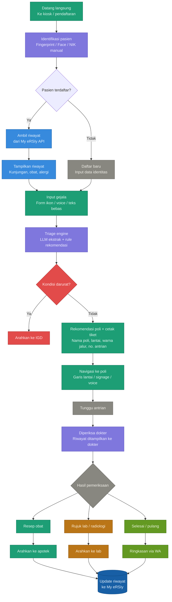

# Design Thinking

## 1. EMPATHIZE

### Siapa penggunanya?
- **Pasien umum** — Berbagai usia, latar belakang, dan tingkat literasi.
- **Lansia** — Tidak familiar dengan teknologi, mungkin memiliki gangguan visual atau pendengaran.
- **Pendamping pasien** — Keluarga yang panik dan terburu-buru.
- **Staf pendaftaran** — Overload, harus menangani banyak pasien sekaligus.
- **Dokter / perawat poli** — Membutuhkan informasi pasien sebelum pasien datang.

### Pain points yang ditemukan:
- Pasien tidak tahu harus ke poli mana.
- Antrian pendaftaran panjang karena semua proses masih manual.
- Pasien salah poli → kembali ke pendaftaran → antrian ulang.
- Lansia kesulitan membaca papan petunjuk.
- Staf kelelahan karena triage dilakukan secara manual satu per satu.
- Pasien tidak tahu kapan gilirannya dipanggil → duduk terus di ruang tunggu.
- Setelah dari dokter, pasien tidak tahu harus ke apotek atau laboratorium mana.

---

## 2. DEFINE — Rumuskan Masalah

### Problem Statement
> Pasien yang datang ke rumah sakit tidak memiliki informasi yang cukup untuk menavigasi proses pelayanan secara mandiri — mulai dari menentukan poli yang tepat hingga menyelesaikan seluruh rangkaian kunjungan — sehingga bergantung penuh pada staf dan menciptakan bottleneck di pendaftaran.

### How Might We (HMW):
- **HMW** membuat pasien tahu poli yang tepat tanpa harus bertanya kepada staf?
- **HMW** membantu pasien yang tidak bisa membaca atau tidak melek teknologi?
- **HMW** mengurangi beban staf pendaftaran tanpa mengorbankan kualitas layanan?
- **HMW** memastikan pasien tahu langkah berikutnya setelah tiap tahap selesai?

---

## 3. IDEATE — Eksplorasi Solusi

### Ide untuk Input Gejala:
- Form digital dengan ikon bergambar (tanpa teks).
- Voice input — pasien cukup berbicara.
- WhatsApp bot sebelum berangkat ke RS.
- Staf input dengan auto-suggest sistem.

### Ide untuk Diagnosa & Rekomendasi Poli:
- LLM mengekstrak gejala dari input bebas → rule engine menentukan poli.
- Kombinasi symptom checker berbasis keputusan + AI.
- Override manual oleh staf jika sistem tidak yakin.

### Ide untuk Navigasi:
- Tiket fisik dengan peta mini + warna poli.
- Garis warna di lantai.
- Voice announcement di speaker koridor.
- Indoor navigation via QR di tiket.

### Ide untuk Post-Poli:
- Notifikasi WA saat giliran hampir tiba.
- Tiket lanjutan otomatis ke apotek/lab.
- Ringkasan kunjungan dikirim via WA setelah selesai.

---

## 4. PROTOTYPE — Bentuk Solusi

### MVP (Minimum Viable Product):

```text
       [ Kiosk / Tablet Staf ]
                  ↓
Input gejala (voice / touch / assisted)
                  ↓
       Symptom Extractor (LLM)
                  ↓
   Triage Engine (rule-based + LLM)
                  ↓
               Output:
        - Rekomendasi poli
        - Nomor antrian
        - Cetak tiket (nama poli + lantai + warna jalur)
                  ↓
   Notifikasi WA saat giliran dekat
                  ↓
 Setelah dokter → tiket lanjutan ke apotek/lab
```

### Komponen yang dibangun:
- **Backend**: FastAPI + LLM integration.
- **Triage rules**: Dikurasi bersama dokter RS.
- **Kiosk UI**: Touchscreen besar, font besar, ada tombol voice.
- **Tiket**: Cetak thermal printer, ada peta mini + warna.
- **Notifikasi**: WhatsApp Business API / n8n.

---

## 5. TEST — Validasi

### Skenario uji:
- **Lansia 65 tahun tanpa smartphone** → Apakah bisa menggunakan kiosk secara mandiri?
- **Pasien dengan keluhan ambigu** → Apakah triage engine mengarahkan ke poli yang tepat?
- **Pasien salah poli** → Seberapa cepat sistem bisa mengoreksi?
- **Peak hour (pagi hari)** → Apakah sistem tetap responsif dengan 50+ pasien bersamaan?

### Metrik keberhasilan:
- Waktu pendaftaran per pasien turun dari X menit → target < 2 menit.
- Tingkat salah poli < 5%.
- Kepuasan pasien (survey singkat di akhir kunjungan).
- Beban staf pendaftaran berkurang minimal 40%.

### Iterasi:
- Triage rules divalidasi dokter tiap bulan.
- UI kiosk diuji dengan pasien lansia nyata sebelum launch.
- Feedback staf dikumpulkan 2 minggu pertama operasional.

---

## Ringkasan

| Tahap | Output Kunci |
| :--- | :--- |
| **Empathize** | 5 user persona, 7 pain points |
| **Define** | 1 problem statement, 4 HMW questions |
| **Ideate** | 12+ solusi potensial lintas touchpoint |
| **Prototype** | MVP flow + tech stack |
| **Test** | 4 skenario uji + 3 metrik sukses |

---

## Alur Alur Pelayanan (Flowchart)



---

## Production Tech Stack (Final)

### Frontend / Client
- **Next.js 14 (App Router)**: Framework React yang sudah production-ready dengan SSR, routing, dan PWA support bawaan. Cocok untuk kiosk karena bisa jalan offline jika koneksi internal RS terganggu.
- **React Three Fiber + Three.js**: Render 3D avatar langsung di browser tanpa butuh game engine seperti Unity/Unreal. Lebih ringan, mudah diintegrasikan ke Next.js, dan tidak butuh install apapun di sisi pasien.
- **Ready Player Me**: Platform avatar 3D yang export ke format glTF/GLB — langsung kompatibel dengan Three.js. Tidak perlu modeler 3D, avatar bisa dikustomisasi sesuai identitas RSI (warna baju, tampilan dokter/perawat).
- **Tailwind CSS**: Untuk UI form ikon bergambar dan layar kiosk. Utility-first, cepat build, dan mudah maintain font besar + high-contrast yang dibutuhkan untuk aksesibilitas.
- **Framer Motion**: Animasi transisi antar layar kiosk agar terasa smooth dan tidak tiba-tiba. Penting untuk pengalaman pasien lansia agar tidak disorientasi.

### Voice & Avatar Pipeline
- **Faster-Whisper**: Implementasi Whisper yang 4x lebih cepat dengan akurasi sama. Support Bahasa Indonesia dan Jawa. Self-hosted — data suara pasien tidak keluar dari jaringan RS.
- **Ollama + LLM lokal (Mistral 7B)**: LLM berjalan di server internal RS. Alasannya satu: data medis pasien tidak boleh dikirim ke cloud eksternal. Familiar juga karena sudah dipakai di DARSI.
- **Coqui XTTS v2**: TTS open source dengan kualitas suara natural dan support Bahasa Indonesia. Self-hosted, tidak ada biaya per karakter seperti ElevenLabs.
- **MuseTalk**: Lip-sync real-time open source untuk menggerakkan mulut avatar sesuai audio TTS. Bisa self-hosted di GPU server RS.
- **Mixamo (Adobe)**: Animasi avatar gratis — idle, greeting, gesture. Tidak perlu animator 3D, tinggal download dan attach ke model Ready Player Me.
- **Rhubarb Lip Sync**: Konversi audio ke data viseme (gerakan mulut) yang kemudian dikirim ke Three.js untuk animasi. Bridge antara TTS output dan avatar.

### Backend & AI
- **FastAPI + Gunicorn + Uvicorn**: Backend utama yang sudah familiar. Gunicorn sebagai process manager agar tidak crash saat satu worker mati. Uvicorn sebagai ASGI server untuk handle WebSocket real-time.
- **MCP Server (Model Context Protocol)**: Agar LLM bisa memanggil tools secara terstruktur — akses My eRSIy API, baca data antrian, jalankan triage rules — tanpa hardcode semua di backend. Modular, mudah ditambah integrasi baru.
- **LiveKit**: Orkestrasi pipeline voice agent real-time: handle STT → LLM → TTS secara berurutan, termasuk barge-in (pasien bicara saat avatar masih berbicara). Menggantikan WebSocket custom yang kompleks.
- **LangChain / LlamaIndex**: Untuk RAG pipeline triage — ambil konteks riwayat pasien dari My eRSIy, inject ke prompt LLM sebelum memberi rekomendasi poli. Sudah terbukti di arsitektur DARSI.

### Data & Integrasi
- **PostgreSQL**: Database utama untuk sesi kiosk, log triage, dan data antrian. Relasional, mature, dan sudah banyak dipakai di ekosistem RS.
- **Redis**: Cache untuk response LLM yang sering berulang (gejala umum → poli yang sama) dan session state per pasien selama di kiosk. Mengurangi latency signifikan.
- **My eRSIy API connector**: Dibuat custom via MCP Server — pull riwayat pasien saat login biometrik, push data kunjungan baru setelah selesai.

### Infrastruktur
- **Docker + Docker Compose / Kubernetes**: Semua service (FastAPI, Ollama, Whisper, MuseTalk, Redis, PostgreSQL) dikemas dalam container. Mudah deploy, mudah rollback jika ada update bermasalah.
- **Nginx**: Reverse proxy di depan FastAPI. Handle SSL termination, static file serving, dan rate limiting. FastAPI tidak boleh expose langsung ke network RS.
- **GitHub Actions**: CI/CD otomatis — setiap push ke branch main, otomatis test → build Docker image → deploy ke server RS. Tidak perlu deploy manual.
- **Terraform**: Infrastructure as code — konfigurasi server, network, dan volume ditulis sebagai file, bukan klik-klik di dashboard. Environment staging dan production selalu identik.

### Observability
- **Prometheus + Grafana**: Monitor latency pipeline (STT → LLM → TTS), jumlah pasien per jam, error rate, dan resource GPU/CPU. Dashboard bisa ditampilkan ke tim IT RS.
- **OpenTelemetry + Jaeger**: Distributed tracing — kalau ada keluhan "avatar lambat", langsung tahu bottleneck-nya di layer mana (STT? LLM? MuseTalk?).
- **Sentry**: Error tracking real-time — kalau avatar crash atau API My eRSIy timeout, langsung ada alert ke tim developer tanpa harus tunggu laporan.

### Security
- **AES-256 enkripsi**: Data biometrik dan riwayat pasien dienkripsi saat disimpan. Standar minimum untuk data medis.
- **RBAC (Role-Based Access Control)**: Staf pendaftaran, dokter, dan admin IT punya akses berbeda. Dokter tidak bisa ubah konfigurasi sistem, staf tidak bisa lihat rekam medis lengkap.
- **Audit log**: Setiap akses ke data pasien dicatat — siapa, kapan, dari mana. Wajib untuk compliance rumah sakit.
- **VPN + private network**: Semua komunikasi antar service (kiosk → backend → My eRSIy) berjalan di jaringan internal RS. Tidak ada data pasien yang melewati internet publik.

---

## Summary table

| Kategori | Tech |
| :--- | :--- |
| **Frontend** | Next.js, R3F, Ready Player Me, Tailwind, Framer Motion |
| **Voice** | Faster-Whisper, Coqui XTTS v2 |
| **Avatar** | MuseTalk, Mixamo, Rhubarb |
| **Backend** | FastAPI, Gunicorn, LiveKit, MCP Server, LangChain |
| **Data** | PostgreSQL, Redis, My eRSIy connector |
| **Infra** | Docker, Nginx, GitHub Actions, Terraform |
| **Monitoring** | Prometheus, Grafana, OpenTelemetry, Sentry |
| **Security** | AES-256, RBAC, Audit log, VPN |
