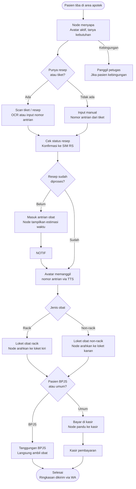

# Product Requirements Document (PRD)
# DARSI Customer Service — RSI A. Yani Surabaya

**Versi:** 1.1 (Draft)
**Terakhir diperbarui:** 30 Juni 2026
**Tim:** IT — KP PENS PSDKU Lamongan 2024
**Status:** In Review

## 1. Overview

DARSI Customer Service (DARSI-CS) adalah ekosistem AI assistant berbasis node yang dirancang untuk memandu pasien RSI A. Yani Surabaya secara mandiri di sepanjang alur pelayanan — mulai dari pendaftaran hingga pengambilan obat. Sistem ini lahir dari kebutuhan untuk mengoptimalkan customer service yang sudah tersedia namun belum dimanfaatkan secara optimal, terutama oleh pasien lansia dan mereka yang tidak melek teknologi.

Inti dari sistem ini adalah jaringan node AI assistant yang tersebar di titik-titik strategis RS. Setiap node menampilkan avatar AI di layar yang berperan seperti petugas RSI sungguhan — dapat merespons suara pasien, memberikan arahan kontekstual, dan memandu langkah berikutnya. Inisiatif ini berasal dari diskusi antara tim akademik PENS (Pak Amma) dan calon Wakil Direktur RSI A. Yani, sehingga sudah memiliki buy-in dari level manajemen rumah sakit. Sistem DARSI existing yang menjadi baseline referensi dapat diakses di [sapadarsi.hcm-lab.id](https://sapadarsi.hcm-lab.id).

## 2. Scope

### In-Scope (Tim IT)

- Integrasi perangkat identifikasi: fingerprint (URU device + touchscreen), face recognition (webcam), OCR KTP (webcam)
- AI backend: Speech-to-Text (STT), Large Language Model (LLM) untuk triage gejala, Text-to-Speech (TTS)
- Voice interaction & dialog flow: alur percakapan pasien dengan node AI
- Integrasi data eksternal: My eRSIy API, SIM RS, API BPJS/JKN
- IoT: Bluetooth smart weight scale, laser sensor tinggi badan
- Dashboard admin: konfigurasi node, manajemen avatar, monitoring sistem

### Out-of-Scope (Tim IT)

- Pembuatan 3D avatar (rigging, animasi, lipsync, facial expression, format VRM) dikerjakan tim MMB
- Desain wayfinding fisik (garis lantai, signage) ditangani pihak RSI langsung
- Pengembangan aplikasi mobile pasien
- Sistem rekam medis elektronik (EMR/EHR) — hanya konsumsi data, tidak modifikasi

## 3. User Personas & Use Cases

### Persona 1 — Pasien Lansia (Pengguna Utama)

**Profil:** Usia 60+, datang sendiri atau dengan pendamping, tidak familiar teknologi, kemungkinan gangguan visual/pendengaran, lebih nyaman berbahasa Jawa atau Madura, tidak selalu bisa membaca istilah medis.

**Use case utama:**
- Datang ke node PM, bicara dengan suara menjelaskan keluhan
- Sistem memandu ke poli yang tepat
- Di lorong, tanya ke node checkpoint arah ke poli
- Setelah dari dokter, tanya ke node apotek cara mengambil obat

### Persona 2 — Pendamping Pasien

**Profil:** Keluarga yang panik dan terburu-buru, lebih melek teknologi dari pasien, berperan sebagai penerjemah antara pasien dan sistem.

**Use case utama:**
- Input keluhan pasien via touchscreen jika lansia kesulitan berbicara ke sistem
- Menggunakan node navigasi untuk mencari arah

### Persona 3 — Operator Loket BPJS

**Profil:** Petugas RS yang menangani pasien dengan surat rujukan fisik, beban kerja tinggi, butuh tools yang mempercepat verifikasi data.

**Use case utama:**
- Scan surat rujukan fisik via kamera, sistem ekstrak data otomatis ke SIM RS
- Lihat ringkasan data pasien di layar operator sebelum melayani

### Persona 4 — Admin Sistem

**Profil:** Staf IT atau supervisor RS yang mengelola konfigurasi node dan memantau performa sistem.

**Use case utama:**
- Tambah, edit, atau nonaktifkan node dari dashboard
- Ganti karakter avatar yang tampil di tiap node
- Monitor status node (online/offline, jumlah interaksi, error rate)
- Lihat log percakapan untuk evaluasi akurasi triage

## 4. Node Architecture

Node adalah unit fisik + software yang menjadi titik interaksi antara pasien dan sistem AI. Setiap node dapat dikonfigurasi karakternya sesuai lokasi dan peran.

### Tipe Node

| Tipe | Hardware | Interaksi |
|---|---|---|
| Node Layar Penuh | Tablet Android + webcam + fingerprint | Touch + voice + avatar visual |
| Node Speaker | Raspberry Pi + mikrofon + speaker | Voice only, tanpa layar |

### Penempatan & Peran Node

| ID Node | Lokasi | Peran Avatar | Tipe |
|---|---|---|---|
| NODE-01 | Area PM / Pendaftaran | Petugas CS / Admin pendaftaran | Layar Penuh |
| NODE-02 | Loket BPJS | Asisten operator loket | Layar Penuh |
| NODE-03 | Lorong PM ke Atrium BPJS | Penunjuk arah | Speaker / Layar |
| NODE-04 | Depan Poli (tiap poli) | Perawat asesmen awal | Layar Penuh |
| NODE-05 | Lorong Atrium ke Apotek | Penunjuk arah | Speaker / Layar |
| NODE-06 | Area Apotek / Antrian Obat | Petugas farmasi + pemanggil antrian | Layar Penuh |

### Konfigurasi Node (via Dashboard Admin)

Setiap node memiliki properti yang dapat dikonfigurasi:
- Karakter avatar yang ditampilkan (dipilih dari library VRM tim MMB)
- Bahasa default interaksi (Indonesia / Jawa / Madura)
- Mode interaksi (voice-first / touch-first)
- Konteks lokasi (menentukan dialog flow yang aktif)
- Status aktif/nonaktif

## 5. Features & Requirements

Prioritas fitur menggunakan skema:
- **P0** — Must have, sistem tidak bisa jalan tanpa ini
- **P1** — Should have, penting untuk pengalaman yang baik
- **P2** — Nice to have, bisa dikerjakan di iterasi berikutnya

### 5.1 Integrasi Perangkat

#### F-DEV-01: Fingerprint via URU Device

**Prioritas:** P0
**Deskripsi:** Sistem membaca sidik jari pasien dari perangkat URU yang terhubung via USB ke tablet Android. Data sidik jari dikonversi ke string dan dikirim ke backend untuk pencocokan dengan database BPJS/JKN.
**Acceptance Criteria:**
- Pembacaan sidik jari berhasil dalam < 3 detik
- Data terkirim ke backend dalam format yang kompatibel dengan API BPJS
- Jika gagal baca, tampilkan opsi fallback (fingerprint touchscreen atau OCR KTP)

#### F-DEV-02: Fingerprint via Touchscreen

**Prioritas:** P1
**Deskripsi:** Opsi verifikasi sidik jari langsung dari permukaan layar tablet tanpa alat tambahan. Membutuhkan tablet dengan sensor fingerprint terintegrasi.
**Acceptance Criteria:**
- Akurasi pembacaan minimal setara dengan URU device
- Seamless fallback dari URU device jika tidak tersedia
- Catatan: perlu riset hardware tablet yang support fitur ini

#### F-DEV-03: Face Recognition

**Prioritas:** P1
**Deskripsi:** Sistem menangkap wajah pasien via webcam dan mencocokkan dengan foto di database BPJS/JKN sebagai metode verifikasi alternatif atau sekunder.
**Acceptance Criteria:**
- Akurasi pengenalan wajah minimal 90% dalam kondisi pencahayaan normal
- Proses verifikasi selesai dalam < 5 detik
- Jika gagal, arahkan ke OCR KTP atau input manual

#### F-DEV-04: OCR KTP

**Prioritas:** P0
**Deskripsi:** Sistem menangkap foto KTP via webcam dan mengekstrak data NIK menggunakan Visual LLM / OCR engine. NIK digunakan untuk verifikasi ke API BPJS/JKN.
**Acceptance Criteria:**
- Ekstraksi NIK akurat minimal 95% untuk KTP dengan kondisi baik
- Waktu ekstraksi < 3 detik
- Fallback ke input manual NIK jika OCR gagal

#### F-DEV-05: OCR Surat Rujukan

**Prioritas:** P1
**Deskripsi:** Operator loket BPJS dapat mengarahkan kamera ke surat rujukan fisik. Sistem mengekstrak data (nama pasien, poli tujuan, tanggal) dan menginputkan ke SIM RS otomatis. Dioperasikan oleh operator, bukan pasien langsung.
**Acceptance Criteria:**
- Ekstraksi data utama (nama, poli tujuan, tanggal) akurat minimal 90%
- Data langsung masuk ke form SIM RS tanpa perlu input ulang manual
- Operator bisa koreksi data hasil OCR sebelum submit

#### F-DEV-06: IoT Smart Weight Scale

**Prioritas:** P1
**Deskripsi:** Integrasi timbangan pintar via Bluetooth untuk pengukuran berat badan pasien secara otomatis. Data langsung masuk ke sistem asesmen awal.
**Acceptance Criteria:**
- Koneksi Bluetooth stabil dan data terbaca dalam < 5 detik setelah pasien naik timbangan
- Kompatibel dengan Xiaomi Smart Scale atau perangkat sejenis

#### F-DEV-07: Laser Sensor Tinggi Badan

**Prioritas:** P2
**Deskripsi:** Sensor laser dipasang di ketinggian tetap (misal 250 cm), mengukur jarak dari sensor ke kepala pasien, menghitung tinggi badan secara otomatis.
**Acceptance Criteria:**
- Akurasi pengukuran ±2 cm
- Data terkirim ke backend dalam < 3 detik
- Protokol komunikasi ke web app perlu ditentukan (open question)

### 5.2 AI Backend

#### F-AI-01: Speech-to-Text (STT)

**Prioritas:** P0
**Deskripsi:** Konversi suara pasien ke teks sebagai input utama sistem. Harus mendukung bahasa Indonesia, Jawa, dan Madura karena mayoritas pasien lansia berkomunikasi dalam bahasa daerah.
**Acceptance Criteria:**
- Akurasi STT bahasa Indonesia minimal 90%
- Akurasi STT bahasa Jawa/Madura minimal 85% (perlu diuji terpisah sebelum development penuh)
- Latensi konversi < 2 detik untuk input suara normal
- Fallback ke input touch jika STT gagal atau confidence rendah

#### F-AI-02: LLM Triage Gejala

**Prioritas:** P0
**Deskripsi:** LLM menerima teks hasil STT dan mengekstrak gejala dari bahasa bebas pasien. Output berupa rekomendasi poli berdasarkan rule engine yang dikurasi bersama dokter spesialis RS.
**Acceptance Criteria:**
- Akurasi rekomendasi poli minimal 85% untuk keluhan umum
- Sistem mengenali kondisi darurat dan langsung arahkan ke IGD
- Triage rules dapat diupdate tanpa deploy ulang sistem
- Override manual tersedia untuk staf jika sistem tidak yakin

#### F-AI-03: Text-to-Speech (TTS)

**Prioritas:** P0
**Deskripsi:** Sistem merespons pasien dengan suara yang keluar dari node. TTS harus terdengar natural dan jelas, mendukung bahasa Indonesia minimal, Jawa/Madura sebagai P2.
**Acceptance Criteria:**
- Output suara jelas dan dapat dipahami lansia (kecepatan bicara tidak terlalu cepat)
- Latensi TTS < 1.5 detik setelah LLM menghasilkan respons
- Volume dan pitch dapat dikonfigurasi per node

#### F-AI-04: Dialog Flow Management

**Prioritas:** P0
**Deskripsi:** Sistem mengelola alur percakapan multi-turn antara pasien dan node. Setiap node memiliki konteks dialog yang berbeda sesuai lokasinya.
**Acceptance Criteria:**
- Sistem dapat menangani percakapan minimal 5 turn tanpa kehilangan konteks
- Setiap node memiliki dialog flow yang sesuai perannya
- Sistem mendeteksi jika pasien keluar dari topik dan mengarahkan kembali

#### F-AI-05: Fallback & Error Handling

**Prioritas:** P0
**Deskripsi:** Setiap node harus memiliki mekanisme fallback yang jelas jika AI gagal memahami input pasien.
**Acceptance Criteria:**
- Setelah 2 kali gagal pahami input, sistem otomatis tawarkan opsi touch atau panggil petugas
- Tombol fisik / area besar "Panggil Petugas" tersedia di setiap node layar
- Log semua error untuk evaluasi dan perbaikan model

### 5.3 Voice Interaction & Dialog Flow

#### F-VOICE-01: Alur Pendaftaran (NODE-01)

**Prioritas:** P0
**Deskripsi:** Dialog flow lengkap untuk proses identifikasi pasien dan input gejala di area PM.

**Alur utama:**
```
Node   : "Selamat pagi, saya bisa bantu Bapak/Ibu.
          Silakan tempelkan jari atau tunjukkan KTP ke kamera."
-> [Identifikasi berhasil]
Node   : "Terima kasih, Pak [Nama]. Ada keluhan apa hari ini?"
Pasien : "Perut saya sakit sejak kemarin"
-> [STT -> LLM triage]
Node   : "Baik, Pak [Nama]. Berdasarkan keluhan Bapak, kami sarankan
          ke Poli Penyakit Dalam di lantai 2. Tiket Bapak sudah dicetak.
          Silakan ikuti garis biru di lantai."
```

**Acceptance Criteria:**
- Dialog terasa natural, tidak kaku seperti IVR lama
- Sistem menyebut nama pasien setelah identifikasi berhasil
- Konfirmasi selalu diberikan sebelum mencetak tiket

#### F-VOICE-02: Alur Navigasi (NODE-03, NODE-05)

**Prioritas:** P1
**Deskripsi:** Dialog flow untuk node checkpoint di lorong — menjawab pertanyaan arah pasien.

**Alur utama:**
```
Pasien : "Poli jantung di mana?"
Node   : "Poli Jantung ada di lantai 3, lurus dari sini terus belok kanan
          setelah lift. Saya tampilkan petanya ya."
-> [Tampilkan peta sederhana di layar]
```

#### F-VOICE-03: Alur Asesmen Awal (NODE-04)

**Prioritas:** P1
**Deskripsi:** Dialog flow untuk pengumpulan data keluhan sebelum masuk poli, berbasis pertanyaan rule-based dari spesialis.

**Alur utama:**
```
Node   : "Selamat datang di Poli [Nama Poli].
          Sebelum masuk, saya perlu tanya beberapa hal ya."
Node   : "Dari skala 1 sampai 10, seberapa parah sakitnya?"
Node   : "Sudah berapa lama merasakan keluhan ini?"
Node   : "Di bagian mana yang terasa sakit?"
-> [Rekap data masuk ke sistem tenaga kesehatan]
```

#### F-VOICE-04: Alur Apotek (NODE-06)

**Prioritas:** P1
**Deskripsi:** Dialog flow untuk panduan pengambilan obat dan pemanggilan antrian di area apotek.

**Alur utama:**
```
Node   : "Selamat datang. Ada yang bisa saya bantu?
          Apakah Bapak/Ibu punya tiket atau resep dari dokter?"
Pasien : "Ada, ini tiketnya"
-> [Scan tiket / input nomor antrian]
Node   : "Baik, resep Bapak/Ibu sedang diproses.
          Estimasi waktu tunggu sekitar 15 menit.
          Silakan duduk, saya akan panggil saat giliran tiba."
-> [Pasien menunggu]
Node   : "Nomor antrian A-012, silakan ke loket obat non-racik
          di sebelah kanan."
-> [Jika BPJS: langsung ambil obat]
-> [Jika umum: arahkan ke kasir dulu]
Node   : "Terima kasih sudah berkunjung. Semoga lekas sembuh."
```

**Flowchart alur apotek (NODE-06):**



**Acceptance Criteria:**
- Avatar memanggil nomor antrian dengan suara jelas dan terdengar dari jarak 5 meter
- Sistem membedakan alur BPJS dan umum secara otomatis dari data pasien
- Estimasi waktu tunggu ditampilkan di layar node dan diperbarui real-time
- Jika pasien tidak berinteraksi selama 30 detik, node menawarkan bantuan secara proaktif

### 5.4 Dashboard Admin

#### F-DASH-01: Manajemen Node

**Prioritas:** P0
**Deskripsi:** Admin dapat melihat daftar semua node, status real-time, dan melakukan konfigurasi.
**Acceptance Criteria:**
- Tampilkan daftar node dengan status online/offline
- Admin bisa aktifkan/nonaktifkan node
- Admin bisa edit properti node (nama, lokasi, bahasa, mode interaksi)

#### F-DASH-02: Manajemen Avatar

**Prioritas:** P0
**Deskripsi:** Admin dapat memilih dan mengganti karakter avatar yang tampil di tiap node dari library VRM yang disediakan tim MMB.
**Acceptance Criteria:**
- Library avatar dapat diisi dengan upload file VRM
- Admin bisa preview avatar sebelum assign ke node
- Perubahan avatar di node berlaku dalam < 30 detik tanpa restart sistem

#### F-DASH-03: Monitoring & Analytics

**Prioritas:** P1
**Deskripsi:** Dashboard menampilkan statistik penggunaan sistem untuk evaluasi performa.
**Acceptance Criteria:**
- Tampilkan jumlah interaksi per node per hari
- Tampilkan akurasi triage (berapa % pasien sampai ke poli yang benar)
- Tampilkan error rate STT dan LLM
- Log percakapan dapat diakses untuk review

#### F-DASH-04: Manajemen Triage Rules

**Prioritas:** P1
**Deskripsi:** Admin atau dokter yang ditunjuk dapat mengupdate aturan triage tanpa perlu deploy ulang sistem.
**Acceptance Criteria:**
- Interface untuk tambah, edit, hapus triage rule
- Rule dapat ditest dengan input gejala simulasi sebelum diaktifkan
- History perubahan rule tersimpan (audit trail)

#### F-DASH-05: Manajemen Antrian Obat (NODE-06)

**Prioritas:** P1
**Deskripsi:** Tampilan antrian obat real-time yang terintegrasi dengan SIM RS. Avatar memanggil nomor antrian via TTS.
**Acceptance Criteria:**
- Antrian update real-time dari SIM RS tanpa refresh manual
- Avatar memanggil nomor antrian dengan suara jelas
- Tampilan nomor antrian besar dan mudah dibaca dari jarak 3 meter

## 6. System Architecture

### Tech Stack

| Layer | Teknologi | Keterangan |
|---|---|---|
| Frontend — Kiosk UI | **Next.js 14 (App Router)** + Tailwind CSS | Dijalankan via Android WebView; build sebagai static export |
| Frontend — Dashboard Admin | **Next.js 14 (App Router)** + Tailwind CSS | Dibuka via browser desktop oleh admin RS |
| Backend | **FastAPI** (Python) + Gunicorn + Uvicorn | ASGI server; support WebSocket native |
| Voice Pipeline | **LiveKit** | Orkestrasi pipeline STT → LLM → TTS + barge-in |
| LLM | **Ollama** + model lokal (Mistral 7B atau sejenisnya) | On-premise; data pasien tidak keluar jaringan RS |
| STT | **Faster-Whisper** | Support Indonesia, Jawa, Madura; berjalan lokal |
| TTS | **Coqui XTTS v2** | Open-source, natural voice, tanpa biaya per karakter |
| Lip Sync | **MuseTalk** (GPU) + **Rhubarb Lip Sync** | Real-time sinkronisasi bibir avatar |
| Database utama | **PostgreSQL** | Sesi kiosk, triage log, analytics, user admin |
| Database integrasi | **MySQL** | Kompatibilitas integrasi SIM RS & data eksternal RS |
| Caching | **Redis** | Session state per pasien; cache respons LLM berulang |
| Avatar runtime | **Three.js** + React Three Fiber | Render avatar VRM/glTF di browser tanpa game engine |
| Avatar source | **Ready Player Me** (format glTF/GLB) | Disediakan tim MMB; dashboard hanya tampilkan thumbnail |
| IoT | Bluetooth (weight scale), protocol TBD (laser sensor) | Dikerjakan Yardan |
| Infrastruktur | **Docker + Docker Compose** / Kubernetes, **Nginx** | Kontainerisasi semua service; Nginx sebagai reverse proxy |
| CI/CD | **GitHub Actions** | Build, test, dan deploy otomatis ke server |

### Integrasi Eksternal

| Sistem | Tujuan Integrasi | Status Akses |
|---|---|---|
| My eRSIy API | Ambil & update riwayat kunjungan pasien | Perlu konfirmasi |
| SIM RS | Input data pendaftaran, resep, antrian | Perlu konfirmasi |
| API BPJS/JKN | Verifikasi kepesertaan via NIK/fingerprint/wajah | Perlu konfirmasi |

### Arsitektur Komponen

```
[Node Hardware]
Tablet Android (WebView) + Webcam + Fingerprint + Speaker + Mic
        |
        | HTTP / WebSocket
        v
[Backend — FastAPI]
├── Auth & Session Service
├── Device Integration Service (fingerprint, webcam, OCR)
├── STT Service (Whisper)
├── LLM Triage Service (Ollama)
├── TTS Service
├── Dialog Flow Manager
└── Admin API
        |
        |------------------------------|----------------------|
        v                              v                      v
[External]                       [Database]              [Cache]
├── My eRSIy API                 ├── PostgreSQL           Redis
├── SIM RS                       └── MySQL
└── API BPJS/JKN
```

### System Flow

## Alur Alur Pelayanan (Flowchart)

```mermaid
flowchart TD
    %% QUICK EMERGENCY SCREEN (BARU - paling depan)
    A1[Datang ke kiosk]
    A0["Quick screen\nApakah ini darurat? + red-flag listening"]
    A0d{Darurat jelas?}

    %% IDENTIFIKASI
    B1[Identifikasi pasien\nFingerprint / Face / NIK manual]
    B2{Pasien terdaftar?}
    B3[Ambil riwayat\ndari My eRSIy API]
    B4[Tampilkan riwayat\nKunjungan, obat, alergi]
    B5[Daftar baru\nInput data identitas]

    %% INPUT GEJALA
    C1[Input gejala detail\nForm ikon / voice / teks bebas]

    %% TRIAGE
    D1[Triage engine\nLLM ekstrak + rule rekomendasi]
    D2{Red-flag darurat\nterdeteksi dari input detail?}
    D3[Arahkan ke IGD\nStaf dipanggil langsung]
    D1b{Confidence tinggi?}
    D1c[Staf review and override manual]

    %% REKOMENDASI and NAVIGASI
    E1[Rekomendasi poli + cetak tiket\nNama poli, lantai, warna jalur, no. antrian]
    E2[Navigasi ke poli\nGaris lantai / signage / voice]

    %% DI POLI
    F1[Tunggu antrian]
    F1a[Panggilan suara\nGiliran mendekat]
    F1b{Pasien/staf merasa\nsalah poli?}
    F2[Diperiksa dokter\nRiwayat ditampilkan ke dokter]

    %% POST POLI non-exclusive
    G1[Hasil pemeriksaan]
    G2{Perlu resep?}
    G3{Perlu rujukan\nlab/radiologi?}
    G5[Arahkan ke apotek]
    G6[Arahkan ke lab]
    G7[Ringkasan via aplikasi]
    G4[Selesai / pulang]

    %% UPDATE
    H1[(Update riwayat\nke My eRSIy)]

    %% CONNECTIONS
    A1 --> A0 --> A0d
    A0d -- Ya --> D3
    A0d -- Tidak atau tidak yakin --> B1

    B1 --> B2
    B2 -- Ya --> B3 --> B4 --> C1
    B2 -- Tidak --> B5 --> C1

    C1 --> D1 --> D2
    D2 -- Ya --> D3
    D2 -- Tidak --> D1b
    D1b -- Tidak --> D1c --> E1
    D1b -- Ya --> E1

    E1 --> E2 --> F1 --> F1a --> F1b
    F1b -- Ya, salah poli --> D1c
    F1b -- Tidak --> F2

    F2 --> G1
    G1 --> G2
    G1 --> G3
    G2 -- Ya --> G5
    G3 -- Ya --> G6
    G1 --> G7 --> G4

    G5 --> G7
    G6 --> G7
    G4 --> H1

    %% STYLING
    classDef teal fill:#1D9E75,stroke:#0F6E56,color:#E1F5EE
    classDef purple fill:#7F77DD,stroke:#534AB7,color:#EEEDFE
    classDef blue fill:#378ADD,stroke:#185FA5,color:#E6F1FB
    classDef gray fill:#888780,stroke:#5F5E5A,color:#F1EFE8
    classDef red fill:#E24B4A,stroke:#A32D2D,color:#FCEBEB
    classDef amber fill:#BA7517,stroke:#854F0B,color:#FAEEDA
    classDef green fill:#639922,stroke:#3B6D11,color:#EAF3DE
    classDef db fill:#185FA5,stroke:#0C447C,color:#E6F1FB

    class A1,C1,E1,E2,G5 teal
    class B1,D1,F2 purple
    class B3,B4 blue
    class B5,F1,G1 gray
    class A0d,D2,D3,F1b red
    class D1b,D1c,G2,G3 amber
    class G4,G7 green
    class H1 db
```



## 7. Non-Functional Requirements

### Performa
- Response time node ke pasien (STT ke LLM ke TTS): < 5 detik end-to-end
- Sistem harus mampu menangani minimal 10 node aktif secara bersamaan
- Uptime minimal 99% selama jam operasional RS (06.00-20.00)

### Bahasa & Aksesibilitas
- Bahasa utama: Bahasa Indonesia
- Bahasa tambahan: Jawa dan Madura (minimal di level STT dan TTS)
- Font layar kiosk minimal 24pt untuk aksesibilitas lansia
- Kontras warna memenuhi standar WCAG AA
- Tombol "Panggil Petugas" selalu visible dan mudah dijangkau

### Keamanan & Privasi Data
- Data biometrik (fingerprint, wajah) tidak disimpan lokal di node — hanya dikirim ke backend terenkripsi
- Data pasien hanya dapat diakses oleh sistem yang berwenang
- Log percakapan tidak menyimpan data sensitif medis secara plain text
- Koneksi node ke backend menggunakan HTTPS/WSS

### Higienitas
- Interaksi voice-first meminimalkan kebutuhan sentuh layar
- Layar menggunakan material anti-fingerprint yang mudah dibersihkan
- Desain hardware node mempertimbangkan kemudahan sanitasi

### Fallback & Ketahanan
- Jika koneksi internet/backend terputus, node menampilkan pesan dan opsi panggil petugas
- Jika STT gagal 2 kali berturut-turut, sistem beralih ke mode touch otomatis
- Jika avatar tidak dapat dirender, sistem tetap berfungsi dengan suara saja

## 8. Pembagian Jobdesk Tim IT

| Nama | Fokus | Komponen |
|---|---|---|
| Irawan | AI Layer | STT (Whisper + uji bahasa Jawa/Madura), LLM triage (Ollama + prompt engineering), TTS, Dialog Flow Manager, OCR KTP & surat rujukan, Face recognition |
| Yardan | Backend & Integrasi | FastAPI setup, Auth & Session Service, Device Integration Service, integrasi My eRSIy API + SIM RS + BPJS/JKN, IoT (weight scale + laser sensor), PostgreSQL + MySQL + Redis |
| Bagus | Frontend + Backend Support | Dashboard admin UI (manajemen node, avatar, monitoring, triage rules), UI kiosk node (layar pasien, voice interface, fallback touch), WebView Android wrapper, bantu endpoint Admin API |

> [!NOTE]
> Catatan: pembagian ini untuk keperluan laporan KP masing-masing. Pengerjaan tetap bersifat kolaboratif terutama di tahap awal.

## 9. Open Questions

| # | Pertanyaan | Owner | Prioritas |
|---|---|---|---|
| 1 | Akses API BPJS/JKN — endpoint apa yang tersedia dan data apa yang bisa diambil? | Pak Naufal / pihak RS | P0 |
| 2 | Integrasi SIM RS — apakah ada dokumentasi API yang bisa diakses tim? | Pak Naufal / IT RS | P0 |
| 3 | Spesifikasi tablet yang akan digunakan — Android versi berapa, apakah support fingerprint touchscreen? | Tim IT | P0 |
| 4 | Fingerprint via touchscreen — hardware tablet apa yang support fitur ini secara native? | Tim IT | P1 |
| 5 | Alur pasien BPJS via faskes 1 — bagaimana data rujukan dari faskes 1 bisa divalidasi sistem? | Pak Naufal / pihak RS | P1 |
| 6 | Laser sensor tinggi badan — protokol komunikasi apa yang digunakan ke web app? | Tim IT | P2 |
| 7 | STT bahasa Jawa/Madura — model mana yang paling akurat? Perlu eksperimen terpisah sebelum commit ke satu model. | Tim IT | P0 |
| 8 | Bahasa antarmuka — apakah UI kiosk juga perlu Jawa/Madura atau cukup di level voice? | Pak Amma / pihak RS | P2 |
| 9 | My eRSIy API — apakah sudah ada dokumentasi dan akses sandbox untuk pengembangan? | Pak Naufal / IT RS | P1 |